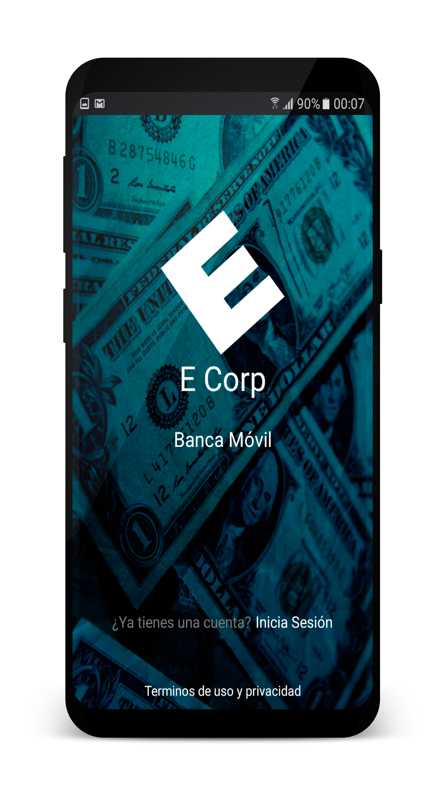
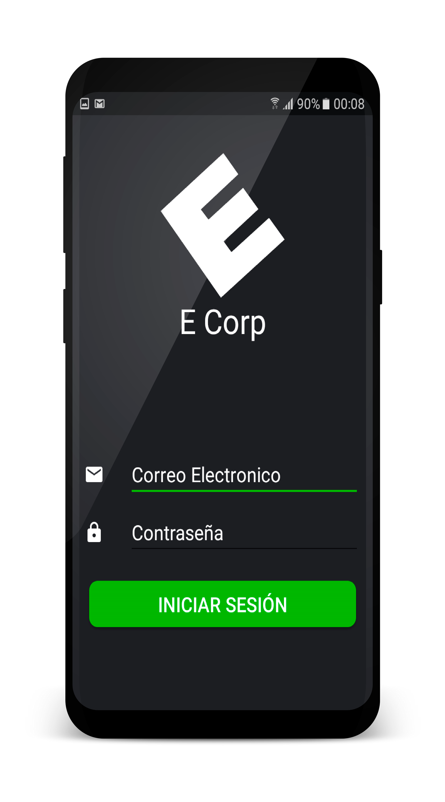
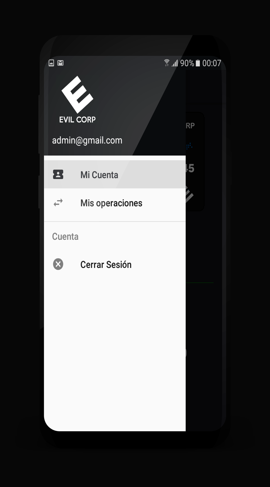
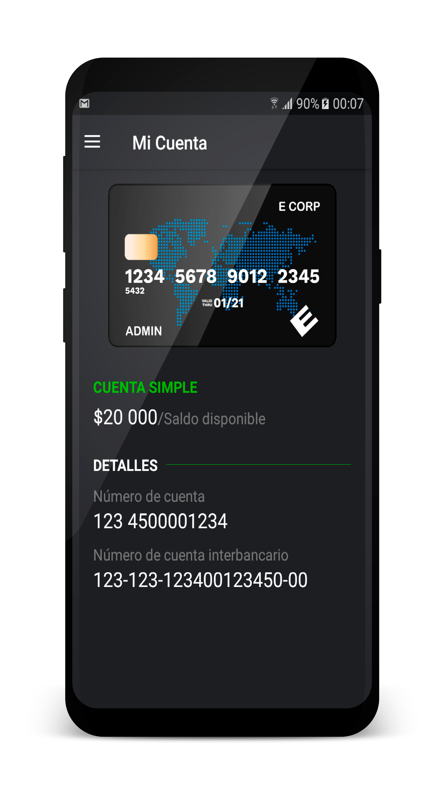
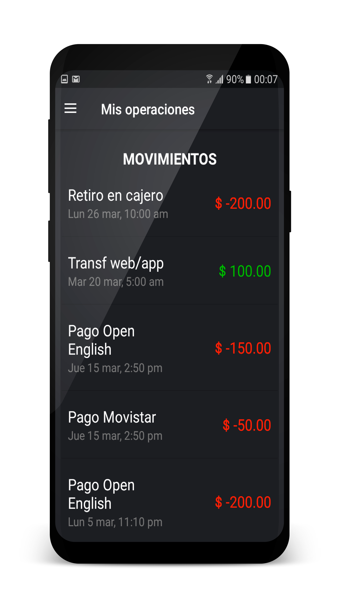

# OWASP Cusco - ANDROID

# Banca Móvil App

Internet se ha vuelto parte esencial en nuestras vidas. Cuando nos despertamos, lo primero que hacemos es revisar nuestros celulares. De acuerdo con Facebook, el Perú cuenta con más de 19 millones de internautas que hacen uso de diferentes aplicaciones. 

Asimismo, de acuerdo con la Asociación de Bancos del Perú (Asbanc), menos de la mitad de transacciones que se realizan en nuestro país, utilizan dinero en efectivo.  Ante dicho escenario, las entidades financieras han ajustado sus productos y servicios, creando canales alternativos como la Banca Móvil o la Banca por Internet , con la finalidad de satisfacer las necesidades que implica este nuevo entorno. 

## Objetivo : 

- Prototipo de una app de banca móvil, 
- Aporte para la comunidad [OWASP](https://www.owasp.org) Cusco.
- Inspirado en la compañia E Corp de la serie [MR. Robot](https://es.wikipedia.org/wiki/Mr._Robot).

## Detalles :

- Correo: admin@gmail.com
- Password: admin

        
        
        
        
        
        
        
        
        
        

	
## Developed by

* Fahed Hermoza, Visitame en [Facebook](https://www.facebook.com/fahedhermoza/) para más detalles.

